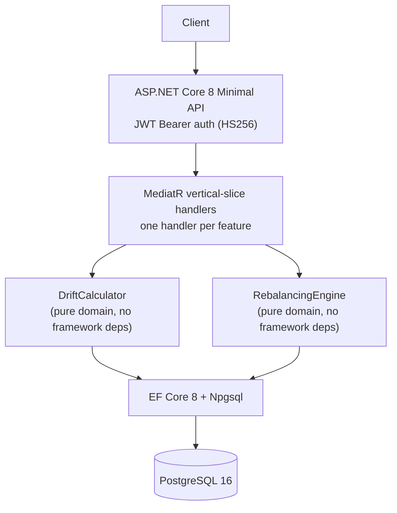

# Portfolio Rebalancer


A REST API for investment portfolio drift detection and rebalancing order generation. Given a portfolio's target allocation and current market prices, it calculates drift per position and generates buy/sell orders to restore balance.

Deploy via Terraform and run on EC2 (see [Deployment](#deployment)). No persistent live URL: EC2 provisioning costs apply; spin up locally with `docker compose up`.

## Problem

Maintaining a target asset allocation requires periodic rebalancing as market prices shift positions away from their targets. Doing this manually across multiple portfolios is error-prone: it requires computing weighted values, comparing to targets, and sizing orders correctly while selling before buying.

## Solution

A stateful REST API that persists portfolio definitions (target allocations, drift tolerance) and purchase history (lots with cost basis), then computes drift and generates orders on demand. Sells are always sequenced before buys so proceeds fund purchases.

## Architecture



All drift calculation and order generation is pure domain logic with no framework dependencies. Handlers are thin: load from DB, call domain service, persist result, return DTO.

## Tech Stack

| Layer | Technology | Why |
|---|---|---|
| Runtime | ASP.NET Core 8 (.NET 8 LTS) | Enterprise .NET standard; Minimal API eliminates controller boilerplate |
| Architecture | MediatR 12 (CQRS, vertical slices) | One handler per feature; avoids service-layer sprawl |
| ORM | EF Core 8 + Npgsql | Fluent API config, typed migrations, PostgreSQL-native types |
| Database | PostgreSQL 16 | Reliable, decimal-safe arithmetic (no float rounding in financial math) |
| Auth | JWT HS256 (JwtBearer 8) | Stateless; UserId claim scopes every query to the calling user |
| Testing | xUnit + TestContainers.PostgreSql + FluentAssertions | Integration tests hit a real PostgreSQL container, not SQLite or mocks |
| Infra | Terraform (AWS EC2 t2.micro + RDS db.t3.micro) | Free-tier eligible; OIDC GitHub Actions deploy (no stored credentials) |

## API Reference

All `/api/*` endpoints require `Authorization: Bearer <jwt>`.

| Method | Path | Description |
|---|---|---|
| GET | `/health` | liveness check |
| POST | `/api/portfolios` | create portfolio with target allocations |
| GET | `/api/portfolios/{id}` | get portfolio |
| POST | `/api/portfolios/{id}/holdings` | add a holding with purchase lots |
| POST | `/api/portfolios/{id}/drift` | calculate drift (body: `{ prices: {...} }`) |
| POST | `/api/portfolios/{id}/rebalance` | generate and persist rebalancing orders |
| GET | `/api/portfolios/{id}/rebalance` | rebalancing history |

### Example: Create and rebalance

```bash
# Create a 60/40 portfolio with 5% drift tolerance
curl -X POST http://localhost:8080/api/portfolios \
  -H "Authorization: Bearer $TOKEN" \
  -H "Content-Type: application/json" \
  -d '{
    "name": "Core Portfolio",
    "driftTolerancePct": 5.0,
    "allocations": [
      { "ticker": "VTI", "weight": 0.6 },
      { "ticker": "BND", "weight": 0.4 }
    ]
  }'

# Add a holding
curl -X POST http://localhost:8080/api/portfolios/{id}/holdings \
  -H "Authorization: Bearer $TOKEN" \
  -H "Content-Type: application/json" \
  -d '{
    "ticker": "VTI",
    "lots": [{ "shares": 100, "costBasisPerShare": 230.00, "purchasedAt": "2024-01-15" }]
  }'

# Check drift with today's prices
curl -X POST http://localhost:8080/api/portfolios/{id}/drift \
  -H "Authorization: Bearer $TOKEN" \
  -H "Content-Type: application/json" \
  -d '{ "prices": { "VTI": 255.40, "BND": 74.20 } }'

# Generate rebalancing orders (persisted to history)
curl -X POST http://localhost:8080/api/portfolios/{id}/rebalance \
  -H "Authorization: Bearer $TOKEN" \
  -H "Content-Type: application/json" \
  -d '{ "prices": { "VTI": 255.40, "BND": 74.20 } }'
```

**Drift response:**
```json
{
  "totalPortfolioValue": 25540.00,
  "anyOutOfBand": true,
  "positions": [
    { "ticker": "VTI", "targetWeight": 0.6, "actualWeight": 1.0, "driftPct": 40.0, "isOutOfBand": true, "shares": 100, "marketValue": 25540.00 },
    { "ticker": "BND", "targetWeight": 0.4, "actualWeight": 0.0, "driftPct": -40.0, "isOutOfBand": true, "shares": 0, "marketValue": 0.00 }
  ]
}
```

## Getting Started

```bash
cp .env.example .env
# Edit .env with a JWT_SECRET (32+ chars)
docker compose up
```

Swagger UI: `http://localhost:8080/swagger`

Generate a test token:
```bash
# Using jwt-cli (brew install mike-engel/jwt-cli/jwt)
jwt encode --secret "your-secret" --sub "user-id-1"
```

## Running Tests

```bash
# Requires Docker (TestContainers spins up postgres:16-alpine)
dotnet test
```

Tests: 18 unit (domain logic, no DB) + 7 integration (real PostgreSQL via TestContainers).

## Deployment

```bash
cd infra/terraform
cp terraform.tfvars.example terraform.tfvars
# Edit with db_password, jwt_secret, ecr_image_uri

terraform init
terraform apply
```

Outputs the EC2 public IP and ECR repository URL. See [infra/README.md](infra/README.md) for full deployment steps including OIDC setup.

## Domain Design Notes

**Drift formula:** `drift_pct = (actual_weight - target_weight) * 100`. A position is out-of-band when `|drift_pct| > drift_tolerance_pct`.

**Order sizing:** `shares_to_trade = |target_value - actual_value| / price`. Sells generated first (proceeds fund buys).

**Weight validation:** Target allocations are validated to sum to 1.0 at portfolio creation (tolerance: 0.001). The database stores weights as `numeric(8,6)` to avoid floating-point drift.

**Per-user isolation:** Every query filters on `UserId` extracted from the JWT `sub` claim. A user can only see and modify their own portfolios.

## Known Limitations

- Prices are caller-supplied: there is no market data integration. The caller is responsible for providing current prices at drift/rebalance time.
- Rate limiting is not implemented. Intended as a private API behind authentication.
- Lot-level FIFO sell assignment (tax-loss harvesting order) is not implemented. Orders specify share counts only.
- In-production HTTPS requires a reverse proxy (nginx or ALB with ACM certificate) in front of the container.
- The free-tier RDS instance (db.t3.micro) has limited IOPS; not suitable for high-volume workloads.
